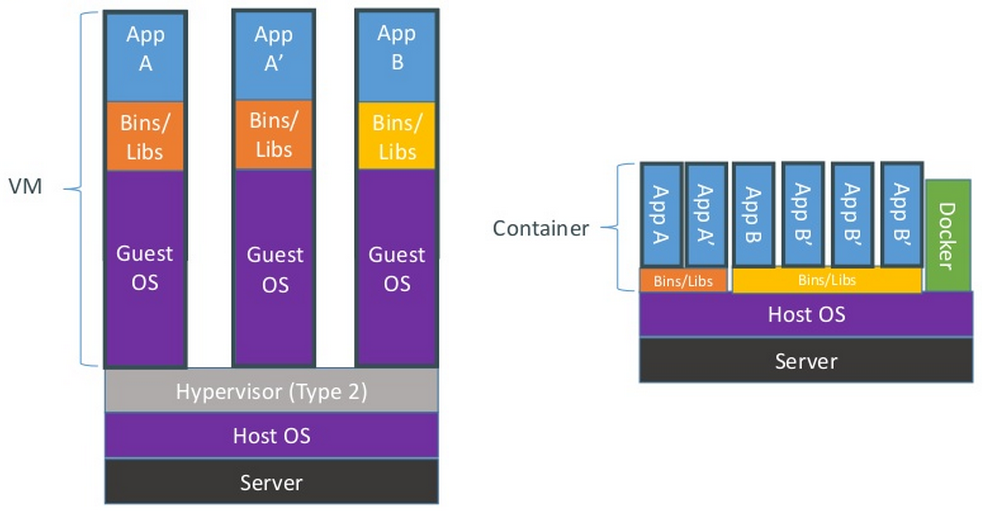

## Procedimentos de Deploy

Esta página apresenta os procedimentos de deploy das aplicações do meu mestrado, esses procedimentos são fortemente baseados na utilização das tecnologias Gitlab-CI, Docker e Container Registry e por este motivo elas serão descritas aqui.  

## *Docker*

O Docker utiliza a virtualização em nível de sistema operacional, onde instâncias virtuais compartilham um único kernel e podem diferir apenas no espaço do usuário. Nesse tipo de virtualização, o sistema convidado deve compartilhar recursos e é vinculado ao kernel do sistema operacional hospedeiro, a única informação que precisa estar em um contêiner é o executável e suas dependências . Contêineres são leves e ganharam muito espaço no mercado
com tecnologias como *Docker* e *LXC*. A imagem a seguir representa as principais diferenças na arquitetura entre máquinas virtuais e contêineres.




*Docker* é uma plataforma aberta para desenvolvimento, *deploy* e execução de aplicativos. O *Docker* Engine é um aplicativo cliente-servidor composto de três componentes, um servidor em execução como um *daemon*, uma API REST e uma CLI. O cliente *Docker* fala com o *daemon* que constrói os aplicativos em imagens e execute-os como contêineres. O cliente e o *daemon* podem ser executados no mesmo sistema ou o comunicar usando a API REST sobre soquetes UNIX ou uma interface de rede. *Docker* também fornece um *Registry*, chamado *Docker Hub*, onde as imagens geradas pelos usuários podem ser armazenadas e puxadas para uso. A imagem a seguir exemplifica a arquitetura do *Docker*.


### Dockerfile

O *Dockerfile* é um arquivo, geralmente presente na pasta raiz do repositório, que indica ao *Docker* Engine como construir uma determinada Imagem. Ele possui uma linguagem simples e composta de algumas palavras reservadas. No geral, um *Dockerfile* possui instruções de como construir as dependências e executar o projeto. Abaixo é apresentado o Dockerfile do projeto [tim-nakedsim](https://gitlab.com/electricdreams/tim-nakedsim).

```
FROM alpine:latest
ENV FLASK_APP=run.py FLASK_CONFIG=production FLASK_PORT=5000 NODE_ENV=production
RUN apk add --no-cache python3 && \
    python3 -m ensurepip && \
    rm -r /usr/lib/python*/ensurepip && \
    pip3 install --upgrade pip setuptools && \
    if [ ! -e /usr/bin/pip ]; then ln -s pip3 /usr/bin/pip ; fi && \
    if [[ ! -e /usr/bin/python ]]; then ln -sf /usr/bin/python3 /usr/bin/python; fi && \
    rm -r /root/.cache
RUN apk add --update --no-cache python3-dev nodejs nodejs-npm py-mysqldb mysql-dev gcc g++ make git bash
RUN npm install --only=production -g bower
COPY . /parasite
WORKDIR /parasite
RUN pip3 install -r requirements.txt
RUN cd app/static && npm install --only=production && cd ../../
RUN cd app/static && bower --allow-root -P install && cd ../../
EXPOSE 5000
CMD ['python3', 'run.py']
```

As palavras reservadas neste Dockerfile são:


|    **Comando**    |      **Descrição**           |
| ----------------- | -----------------------------|
| FROM      | Deve ser sempre a primeira palavra no Dockerfile, especifica qual Imagem deve ser usada como base para a construção da nova Imagem. |
| COPY      | Copia os arquivos de um diretório para um outro alvo, neste caso, copiando do root para a pasta tim-nakedsim. |
| WORKDIR   | Seta qual diretório deve ser utilizado como base para a Imagem e os próximos comandos executados. |
| RUN       | Executa um comando do shell, neste caso adiciona permissões de execução para os scripts de instalação e realiza a instalação das dependências |
| EXPOSE    | Informa ao Docker que o contêiner escuta na porta especificada em tempo de execução. |
| CMD       | Define um ponto de execução padrão para o Imagem, os scripts contidos neste comando serão executados assim que o contêiner for iniciado. |

### Imagens

Uma imagem do Docker é composta de um conjunto de camadas, que representam alterações no sistema de arquivos da imagem base, estas alterações estão descritas no arquivo de configuração chamado de *Dockerfile*. Ao ser executada, é adicionada a imagem uma camada chamada de `Container Layer`, todas as alterações no contêiner que está em execução são escritas nesta nova camada. A imagem abaixo ilustra a interação entre as camadas de uma imagem e a camada execução do contêiner.


### Contêineres

Os contêineres se diferenciam de imagens do *Docker* apenas pela presença da nova camada de execução, onde as modificações recentes na imagem ficam salvas. Ao deletar um contêiner, sua camada de execução também é removida e as modificações feitas nela se perdem, porém a imagem que foi usada para a execução do contêiner é mantida inalterada. Desta forma, vários contêineres podem ser executados a partir de uma imagem e manterem seus dados independentemente. A imagem abaixo apresenta como um grupo de contêineres podem compartilhar a mesma imagem.


## *Registry*

O `Registry` é uma aplicação *server side* de alta escalabilidade que armazena e permite ao usuário distribuir imagens do *Docker*. O Gitlab provê um `Container Registry` que divide espaço com o repositório, sendo que o limite de espaço é de `10Gb`. Neste *Registry*, as imagens podem ser armazenadas automaticamente utilizando os *pipelines* do Gitlab-CI, isto pode ser feito através do `.gitlab-ci.yml` configurando o mesmo para gerar e registrar a imagem.


```
image_build:
  stage: docker_build
  before_script:
    - docker info
    - docker login -u gitlab-ci-token -p ${CI_JOB_TOKEN} ${CI_REGISTRY}
  script:
    - docker pull ${RELEASE_IMAGE} || true
    - docker build --cache-from ${RELEASE_IMAGE} --tag ${CONTAINER_IMAGE}:${CI_COMMIT_SHA} .
    - docker push ${CONTAINER_IMAGE}:${CI_COMMIT_SHA}
```


Após o registro da imagem, para utilizá-la são necessários os seguintes comandos.

1.  Logar no *Registry*:

```
docker login registry.mrdevops-gitlab.com
```

2.  Fazer o download da image mais atual:
```
docker pull registry.mrdevops-gitlab.com/ParasiteWeb/<repositório>
```

3.  Executar o *container*:
```
docker run -tid -p <porta_host>:<porta_guest> --name <nome> registry.mrdevops-gitlab.com/ParasiteWeb/<repositório>
```

## *Gitlab-CI*

O Gitlab-CI é compatível com todos os passos necessários para *build*, *upload* e *deploy* de uma aplicação baseada em contêineres, para que isso ocorra é necessário que dentro da pasta do projeto exista um *Dockerfile*, depois é necessário que o Gitlab-CI esteja configurado para realizar os passos para construção e registro da imagem, isto pode ser feito seguindo o exemplo abaixo.

```
variables:
  CONTAINER_IMAGE: registry.mrdevops-gitlab.com/${CI_PROJECT_PATH}
  RELEASE_IMAGE: registry.mrdevops-gitlab.com/${CI_PROJECT_PATH}:latest

image_build:
  stage: docker_build
  before_script:
    - docker info
    - docker login -u gitlab-ci-token -p ${CI_JOB_TOKEN} ${CI_REGISTRY}
  script:
    - docker pull ${RELEASE_IMAGE} || true
    - docker build --cache-from ${RELEASE_IMAGE} --tag ${CONTAINER_IMAGE}:${CI_COMMIT_SHA} .
    - docker push ${CONTAINER_IMAGE}:${CI_COMMIT_SHA}

image_release:
  stage: release
  before_script:
    - docker info
    - docker login -u gitlab-ci-token -p ${CI_JOB_TOKEN} ${CI_REGISTRY}
  script:
    - docker pull ${CONTAINER_IMAGE}:${CI_COMMIT_SHA}
    - docker tag ${CONTAINER_IMAGE}:${CI_COMMIT_SHA} ${RELEASE_IMAGE}
    - docker push ${RELEASE_IMAGE}


deploy_prod:
  stage: deploy
  before_script: 
    - apt update -y && apt install sshpass
  script:
    - sshpass -p ${DEPLOYMENT_SERVER_PASS} ssh -o StrictHostKeyChecking=no -o PreferredAuthentications=password -o PubkeyAuthentication=no ${DEPLOYMENT_SERVER_USER}@${DEPLOYMENT_SERVER_IP} "sudo docker login -u gitlab-ci-token -p ${CI_JOB_TOKEN} ${CI_REGISTRY} && sudo docker stop parasite && sudo docker rm parasite && sudo docker pull ${CI_REGISTRY}/${CI_PROJECT_PATH}:latest && sudo sudo docker run -tid -p 8888:8000 --name parasite ${CI_REGISTRY}/${CI_PROJECT_PATH}:latest"

```