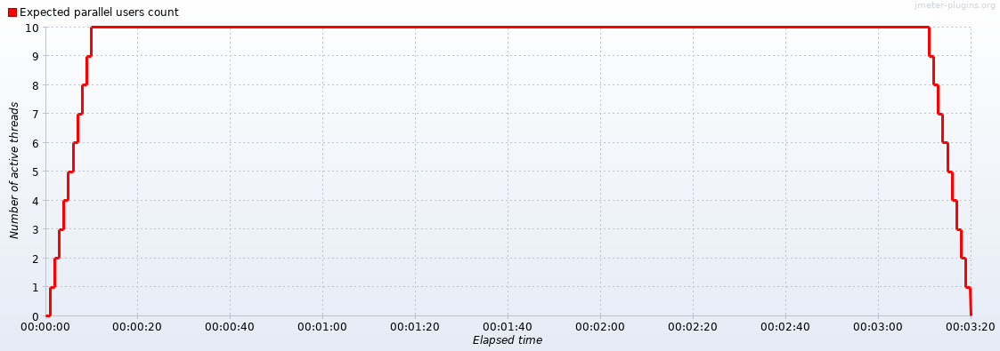
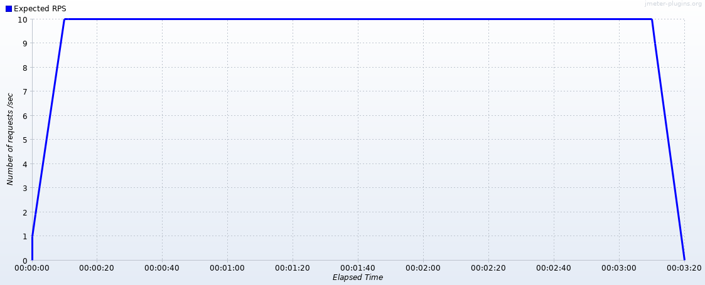

## Definição

Execução dos testes de desempenho utilizando o JMeter como ferramenta de Teste e um cluster do Kubernetes com as configurações já listadas anteriormente. 

## Ferramentas

*  JMeter
*  JMeter Plugin Manager
*  JMeter Custom Thread Groups
*  Throughput Shapping Timer

## Número de Threads

Para calcular o número de threads utilizou-se a seguinte expressão:

**RPS** * **max response time** / **1000** = **Thread Number**

**RPS** = Responses Per Second

Os números utilizados foram:

|Test Number| RPS | Max Response Time (ms) | Threads|
| ------ | ------ | ------ | ------ |
|0| 10 | 100 | 1 |
|1| 10 | 1000 | 10 |
|2| 10 | 10000 | 100 |
|3| 100 | 100 | 10|
|4| 100 | 1000 | 100|
|5| 100 | 10000 | 1000 |
|6| 1000 | 100 | 100|
|7| 1000 | 1000 | 1000|
|8| 1000 | 10000 | 10000|

* Total Execution Time: 200 sec
* Start Up Time: 10 sec
* Shutdown Time: 10 sec
* Hold Load for: 180 sec

RPS 10 Curve

## Execução

### Teste 0

### Teste 0
### Teste 0
### Teste 0
### Teste 0
### Teste 0

####

