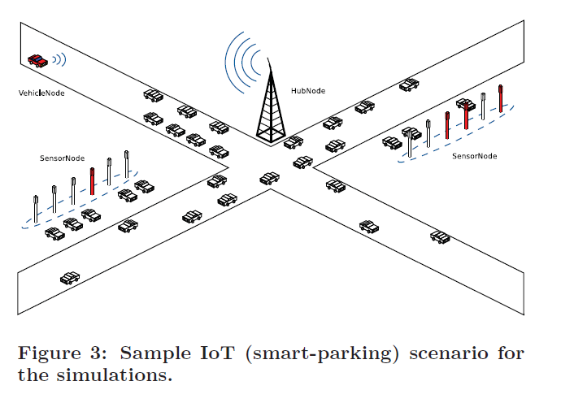
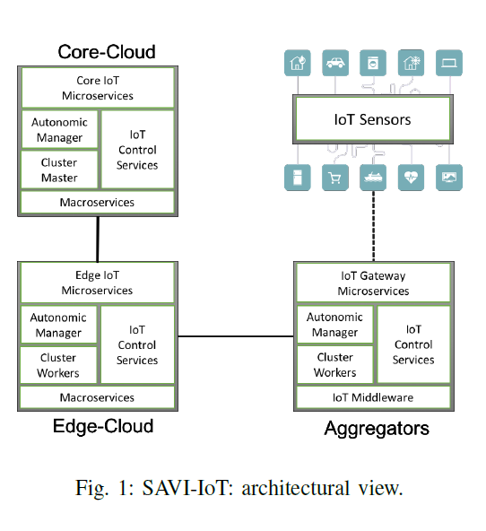
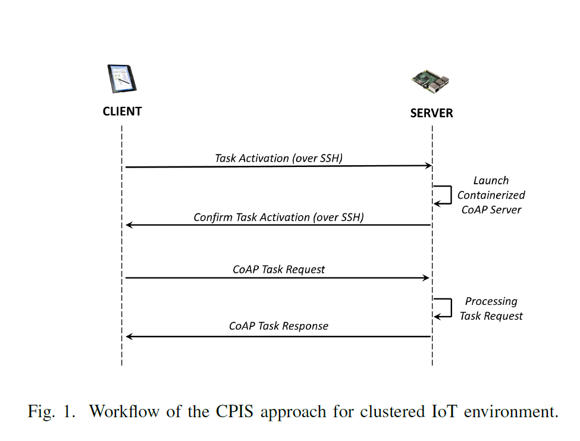
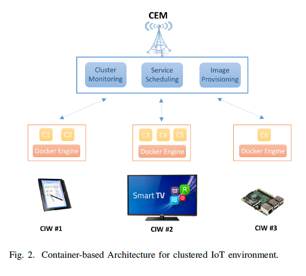

## Concerns

### **Retirado de: A Scalable Distributed Architecture Towards Unifying IoT Applications**
*  Heterogeneity
*  Scalability
*  Interoperability
*  Security & Privacy

### **Retirado de: A Scalable Framework for Provisioning Large-Scale IoT Deployments**

*  Atualização de software/deploy de novas funcionalidades

>  Currently, configuration and provisioning of IoT devices must largely be
performed manually, making it difficult to quickly react to changes in application or
infrastructure requirements. Moreover, we see the emergence of IoT devices (e.g., Intel
IoT gateway,3 SmartThings Hub,4 and Raspberry Pi5) that offer functionality beyond
basic connected sensors and provide constrained execution environments with limited
processing, storage, and memory resources to execute device firmware. These currently
unused execution environments can be incorporated in IoT systems to offload parts of
the business logic onto devices. In the context of our work, we refer to these devices as
IoT gateways.

### **Retirado de: A Simulation Platform for Large-Scale Internet of Things Scenarios in Urban Environments**

*  Quantidade de conexões

>  The scenarios we have decided to simulate belong to a
typical application case of the Internet of Things in urban
environments: a smart parking infrastructure where in each
parking lot a sensor node is deployed to detect the presence
or absence of a vehicle [13]. Moreover, there are gateways
that take charge of collecting data from the sensor network,
and vehicles that move around the city and contact the gateways,
searching for an available parking lot.
In particular, we have defined that vehicle requests to
gateways are scheduled by an Homogeneous Poisson Process
with interarrival time being an exponentially distributed
random variable whose mean interarrival time is equal to
5 minutes. When a vehicle makes a request, it communicates
with the geographically nearest gateway. The number
of vehicles looking for a parking lot is chosen so that, at the
end of the simulation, 10% of the traveling vehicles have issued
a parking request to the gateways. Next, the gateway
contacts the parking sensors under its own responsibility and
waits for their response. Therafter, it communicates a response
to the vehicle. All this happens for a lifetime of the
simulation equals to 4 hours...

>  In order to assess the scalability of our simulation platform,
the number of nodes of the simulation has been varied,
as reported in Table 1, and the required computation
time has been measured. Simulations have been executed
on a server with 2 GHz Xeon CPU, 16 GB RAM, Ubuntu
GNU/Linux operating system.

### **Retirado de: Capillary Networks - Bridging the Cellular and loT Worlds**

> Cellular communication technologies can play a crucial
role in the development and expansion of loT. Cellular networks
can leverage their ubiquity, integrated security, network
management and advanced backhaul connectivity capabilities
into loT networks. In this regard, capillary networks [5][
7] aim to provide the capabilities of cellular networks to
constrained networks while enabling the connectivity between
wireless sensor networks and cellular networks. Hence, a
capillary network provides local connectivity to devices using
short-range radio access technologies while it connects to the
backhaul cellular network through a node called Capillary
Gateway (CGW)

>  In our system, the distributed cloud for loT devices includes
both data centers (DCs), where larger amounts of data
from different sources can be processed and where also management
functions typically reside, as well as local compute
infrastructure, in particular within capillary networks. The
latter makes it possible to process data locally, for example, to
aggregate or filter sensor data, which can reduce the amount
of data that is sent upstream towards data centers. Moreover,
it enables also low-latency sensor-actuator control loops.
In particular, we use containers, such as Docker [18], for
packaging, deployment (including updates and new features),
and execution of software in our cloud. In general, containers
have a low overhead, which, in turn, allows a high density
of instances in DCs. Moreover, containers can be executed in
more constrained environments without hardware virtualization
support, such as in local CGWs.

### **Retirado de: Challenges and Opportunities in Edge Computing**

> Research in micro operating systems or microkernels can
provide inroads to tackling challenges related to deployment
of applications on heterogeneous edge nodes. Given
that these nodes do not have substantial resources like
in a server, the general purpose computing environment
that is facilitated on the edge will need to exhaust fewer
resources. The benefits of quick deployment, reduced boot
up times and resource isolation are desirable [47]. There is
preliminary research suggesting that mobile containers that
multiplex device hardware across multiple virtual devices
can provide similar performance to native hardware [48].
Container technologies, such as Docker31 are maturing and
enable quick deployment of applications on heterogeneous
platforms. More research is required to adopt containers as
a suitable mechanism for deploying applications on edge
nodes

### **Retirado de: End-to-End Management of IoT Applications**

> Aggregators (i.e., IoT gateways) are located outside of
the cloud and may be deployed on single board computers
(e.g., Raspberry PIs), mini computers, or smart devices
(e.g., smart phones, TVS or refrigerators) to provide management,
connectivity, and data preprocessing for sensors’ data. 
The main responsibility of IoT middleware is to facilitate such functionalities at aggregators.
A worker node of a cluster based data processing platform
may be deployed on aggregators (i.e., Cluster worker).
An example for this can be a worker node of a Kafka3
cluster that is responsible for in-place data cleaning and
aggregation. The Aggregator Autonomic Manager component
is a part of the autonomic management system
which is responsible for monitoring performance metrics
of aggregators and scale related microservices if needs
be. IoT Control Services are the control services used by
the autonomic manager to scale or reconfigure microservices.
IoT Gateway Microservices are the part of the IoT
application that implements application functionalities at
this layer. For example, in our sample implementation of
the IoT application, we deploy Kafka as microservices at
Aggregators.

### **Retirado de: Evaluating Performance of Containerized IoT Services for Clustered Devices at the Network Edge**

####Container-based Pair-oriented IoT Service Provisioning (CPIS) 

> According to this approach, management operations are
based on direct data exchanges between the involved devices.
To enable secure transmissions, all control data trac is
exchanged over SSH communications. Indeed, in this paper,
we do not focus on scheduling algorithms to choose the
best candidate node for executing a specific task. Rather, we
aim to investigate on the required procedures to activate a
containerized service and to enable the interaction between
the device requesting the task (i.e., the client) and the device
actually executing the task (i.e., the server) in heterogeneous
IoT environments.
Fig. 1 shows the basic workflow between a client and a
server to achieve container-based IoT service provisioning.
First, the client issues the command for task activation on the
server, which in turn executes the “containerized” service by
leveraging the local Docker Engine. To guarantee the desired
interoperability in compliance with current IoT standards,
Constrained Application Protocol (CoAP) is recommended to
define RESTful application interfaces [34], according to a
traditional client-server model.
Therefore, after the successful activation of the requested
container, interactions between client and server follow the
CoAP protocol rules. Once the desired task is completed,
the client can also issue the command to stop and remove
the container. In this approach, all the control burden is
delegated to the client, which has to comprehensively manage
the instantiation, monitoring, and removal of the instance.
Furthermore, the control requirements can be even increased
when interactions with multiple nodes are required, such as
in one of the following situations: (i) the IoT application is
composed by multiple modules (for example, with dierent
sensing requests); (ii) the IoT client may be in charge of
keeping backup service, so to guarantee service continuity and
reliability even in case of node failure; (iii) the client can
need to scale up or down the service instances by accounting
for the resources of IoT nodes and the actual workload,.
To sum up, this approach can ensure that fast management
procedures are achieved through the direct interaction between
the cooperating nodes, while all the control features for service
lifecycle are implemented in the client.

#### Container-based Edge-Managed Clustering (CEMC)

> According to this second approach, a container-oriented
Orchestration System provides multiple features to: (i) ease
the deployment and monitoring of IoT services over multiple
nodes; (ii) perform periodical service checking and resource
monitoring; (iii) implement replication and auto-scaling
policies. Similarly to the Docker Swarm framework, which
we use as a reference platform, we consider two dierent
logical nodes: Container-oriented Edge Manager (CEM) and
Container-based IoT Worker (CIW), whose features are presented
in the remainder of this subsection. An exemplary
scenario is sketched in Fig. 2, where a CEM controls a cluster
of nodes, operating as CIWs and leveraging the virtualization
features provided by Docker Engine to host containerized IoT
services.
Container-oriented Edge Manager features
In our view, a predominant role has to be played by the
network access point. This latter operates as a manager of the
clustered devices, by both providing network connectivity and
orchestrating integrated IoT applications. Indeed, we believe
that network providers are in a predominant position to oer
new management services to their IoT customers, by leveraging on their capillary infrastructure and on the emerging
cloudification of the edge networks [35].
The CEM is responsible to handle several cluster management
tasks:
  Maintaining the cluster state. The CEM maintains an upto-
date internal state of the entire swarm, accounting for
the available resources oered by each associated device
and for all the services running within the cluster. In a
densely connected environment, multiple CEMs can be
deployed over dierent access points to guarantee fault
tolerance features. Indeed, Docker Swarm uses a Raft
implementation to maintain a consistent distributed state
of the cluster among multiple manager nodes.
  Service scheduling. When a new service is requested,
the CEM needs to select the most appropriate nodes
to deploy the containerized applications, by matching
service requirements and available workers' resources.
 Service monitoring. During the whole application lifecycle,
the CEM must monitor the status of relevant containers
and, if some failures are detected, new instances must
be promptly activated, to guarantee the desired Quality
of Experience.
 Distributing container-based application images. To store
and distribute Docker images containing all the applications
code and dependencies, Docker has introduced
public/private Docker registries. The desired flexibility is
achieved by enabling the CEM to implement a private
registry, to share trusted images among the nodes of the
cluster.
Container-based IoT Worker features
CIWs are devices running instances of Docker Engine
whose sole purpose is to create, start, and stop containers.
These devices require an Operating System, whose kernelsupports container-based virtualization. Some Bootstrap Code
is necessary to activate Docker in Swarm mode, and to
automatically join the desired cluster. Once a CIW has joined
the cluster, the CEM can deploy containerized applications
though the CIW's Docker Engine. If the relevant Docker image
is not locally available, then the CIW's Docker Engine can
retrieve it through either a public Docker registry, i.e., the
Docker Hub, or a private Docker registry running on the CEM.
CIWs can also operate as a proxy or gateway node for
extremely resource-constrained nodes, which do not support
container-based virtualization yet. In [36], gateways features
can be deployed on-demand via Docker containers, to provide
integration capabilities to sensor/actuation devices.
In Fig. 3 an exemplary workflow of CEMC approach
is sketched. After the CEM receives a service requests, it
performs the relevant scheduling operation by identifying the
device which can better host the requested applications in
the cluster. Then, the CEM issues a command to launch the
containerized task in the selected CIW. When the container
is running, the client can send CoAP task request to the containerized
CoAP server running on the CIW, which performs
the desired logic operations providing the output in a proper
CoAP response packet.

### **Retirado de: Feasibility of Fog Computing Deployment based on Docker Containerization over RaspberryPi**

> In
the above situations, it starts to be recognized that at least an
additional layer , e. g., composed by gat eway nodes relatively local
to sensors/actuators , can significant enrich the flexibility and
suitability of the IoT cloud architecture. This intermediate layer
may provide and support in : scalability via more distributed and
localized processing/state main tenance; data aggregation, with
gateways working as data sink s for devices working with high
sample rate; interoperability at network edges by overcoming the
possible heterogene ity due to the large variety in integrated
sensors and actuators ; complementing resource constrained IoT
devices, usually with few storage /computing/communication
resources and limited energy power; dynamic and efficient
registration discovery of IoT devices. It is manifest that t he
effective and efficient integration of IoT and the cloud is
technically challenging and represents a very hot research topic
nowadays . Starting from seminal approaches of proxy
intermediation/optimization even before the cloud introduction 4 ,
5, 6 ], s everal more recent related papers propos e , with slightl y
different flavors, three layer IoT cloud architectures with the
above intermediate layer of resources at network edge s , by
naming their approach as f og computing [ 7 8 ], cloudlet 9 ], edge
computing [ 10 ], or follow me cloud [ 11 Below we will use the
term fog computing in a general way to indicate any three layer
IoT cloud architecture with an intermediate layer of
geographically distributed gateway nodes, typically well
positioned at the edges of network localities that are densely
populated by IoT sensor s and actuators.

> We claim the suitability and effectiveness of introducing a highly manageable and interoperable way to create fog nodes on-the-fly via the adoption of containerization techniques, whose advantages are deemed prevalent to disadvantages also in the case of IoT gateways with limited resource availability. In particular, this section presents how we have enhanced our fog computing middleware via dynamic IoT gateway configuration through i) the creation of standard gateway base configuration; ii) the creation of container-based (typically small and atomic) applications/services, each with very specific functions; and iii) the dynamic orchestration of fog middleware services by the global cloud, with the possibility to install, replace, or extend the currently installed configurations and available middleware services.