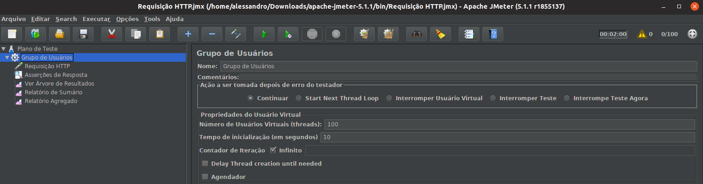
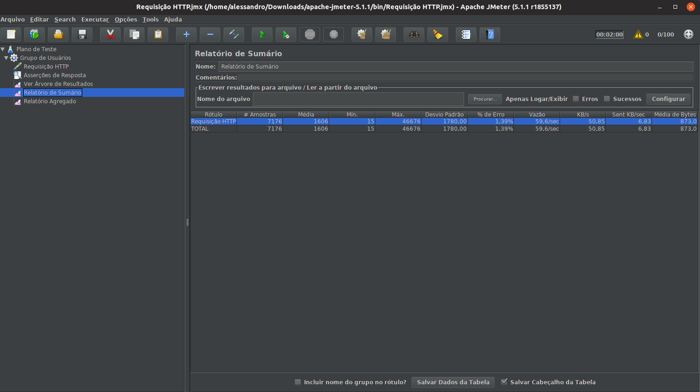
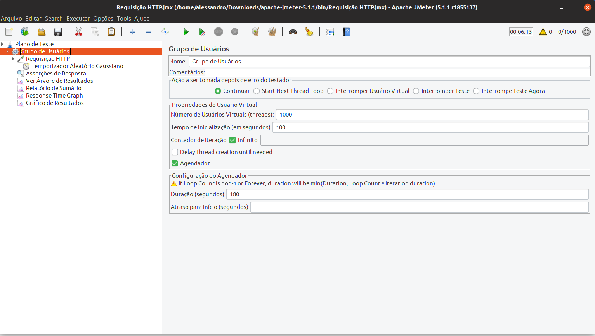
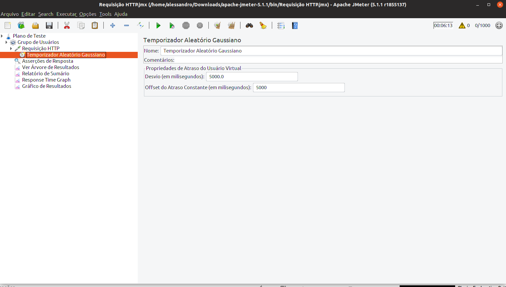
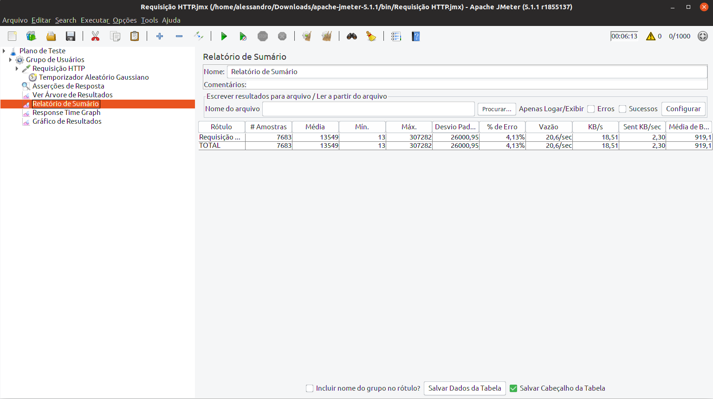
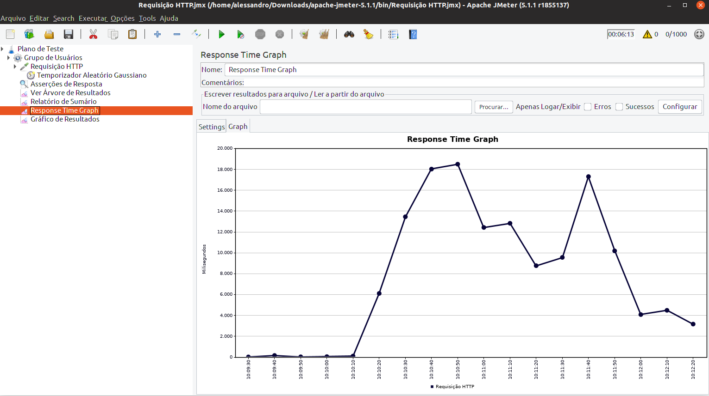

## Configuração do NGINX

### Deployment
```
{
  "kind": "Deployment",
  "apiVersion": "extensions/v1beta1",
  "metadata": {
    "name": "nginx",
    "namespace": "default",
    "selfLink": "/apis/extensions/v1beta1/namespaces/default/deployments/nginx",
    "uid": "0e3a4813-9741-11e9-9f54-2c4d54e2a2ee",
    "resourceVersion": "179203",
    "generation": 1,
    "creationTimestamp": "2019-06-25T12:02:07Z",
    "labels": {
      "app": "nginx"
    },
    "annotations": {
      "deployment.kubernetes.io/revision": "1"
    }
  },
  "spec": {
    "replicas": 1,
    "selector": {
      "matchLabels": {
        "app": "nginx"
      }
    },
    "template": {
      "metadata": {
        "creationTimestamp": null,
        "labels": {
          "app": "nginx"
        }
      },
      "spec": {
        "containers": [
          {
            "name": "nginx",
            "image": "nginx",
            "resources": {},
            "terminationMessagePath": "/dev/termination-log",
            "terminationMessagePolicy": "File",
            "imagePullPolicy": "Always"
          }
        ],
        "restartPolicy": "Always",
        "terminationGracePeriodSeconds": 30,
        "dnsPolicy": "ClusterFirst",
        "securityContext": {},
        "schedulerName": "default-scheduler"
      }
    },
    "strategy": {
      "type": "RollingUpdate",
      "rollingUpdate": {
        "maxUnavailable": "25%",
        "maxSurge": "25%"
      }
    },
    "revisionHistoryLimit": 10,
    "progressDeadlineSeconds": 600
  },
  "status": {
    "observedGeneration": 3,
    "replicas": 3,
    "updatedReplicas": 3,
    "readyReplicas": 3,
    "availableReplicas": 3,
    "conditions": [
      {
        "type": "Available",
        "status": "True",
        "lastUpdateTime": "2019-06-25T12:02:13Z",
        "lastTransitionTime": "2019-06-25T12:02:13Z",
        "reason": "MinimumReplicasAvailable",
        "message": "Deployment has minimum availability."
      },
      {
        "type": "Progressing",
        "status": "True",
        "lastUpdateTime": "2019-06-25T12:02:13Z",
        "lastTransitionTime": "2019-06-25T12:02:07Z",
        "reason": "NewReplicaSetAvailable",
        "message": "ReplicaSet \"nginx-65f88748fd\" has successfully progressed."
      }
    ]
  }
}
```
### Service
```
{
  "kind": "Service",
  "apiVersion": "v1",
  "metadata": {
    "name": "nginx",
    "namespace": "default",
    "selfLink": "/api/v1/namespaces/default/services/nginx",
    "uid": "b859603f-973d-11e9-9f54-2c4d54e2a2ee",
    "resourceVersion": "177223",
    "creationTimestamp": "2019-06-25T11:38:15Z",
    "labels": {
      "app": "nginx"
    }
  },
  "spec": {
    "ports": [
      {
        "name": "80-80",
        "protocol": "TCP",
        "port": 80,
        "targetPort": 80,
        "nodePort": 30822
      }
    ],
    "selector": {
      "app": "nginx"
    },
    "clusterIP": "10.98.20.9",
    "type": "NodePort",
    "sessionAffinity": "None",
    "externalTrafficPolicy": "Cluster"
  },
  "status": {
    "loadBalancer": {}
  }
}

```

### Configuração do Teste 1

#### Entrada

* Número de Usuários: 100
* Tempo de Rampa: 10 segundos
* Tipo de Resposta Aceita: 200 (OK)
* Tempo de Execução: 2 minutos




#### Resultados

* Número de Requisições: 7176
* % Erro: 1,37%
* Tempo de Resposta Médio: 1606 ms





#### Configuração de Teste 2

#### Entrada

* Número de Usuários: 1000
* Tempo de Rampa: 100 segundos
* Tipo de Resposta Aceita: 200 (OK)
* Tempo de Execução: 2 minutos


#### Resultados

* Número de Requisições: 7176
* % Erro: 1,37%
* Tempo de Resposta Médio: 1606 ms









