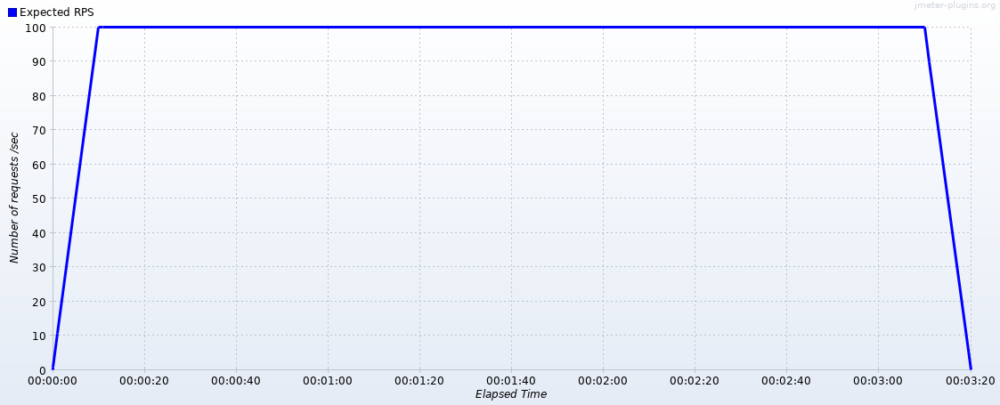
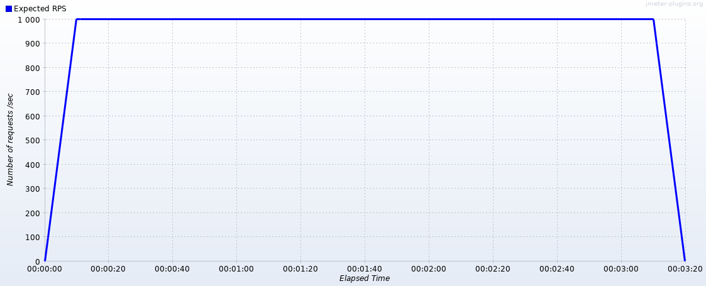
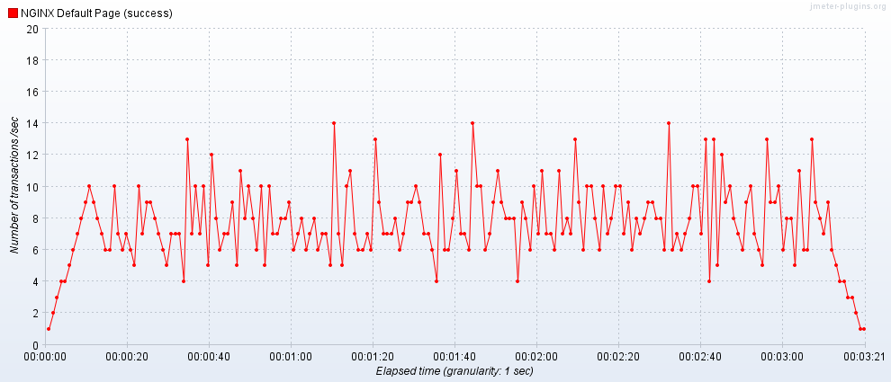
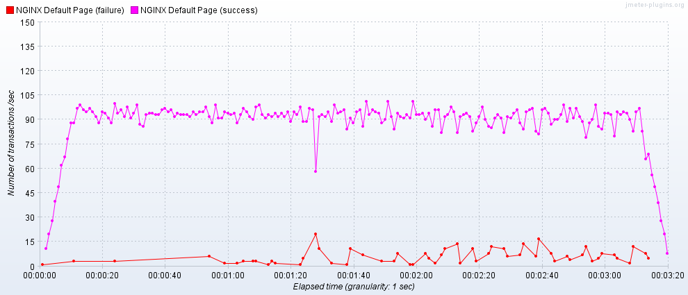

## Definição

Execução dos testes de desempenho utilizando o JMeter como ferramenta de Teste e um cluster do Kubernetes com as configurações já listadas anteriormente. 


## Ferramentas

*  JMeter
*  JMeter Plugin Manager
*  JMeter Custom Thread Groups
*  Throughput Shapping Timer


## Configuração do Cluster


```
apiVersion: apps/v1
kind: Deployment
metadata:
  name: nginx
  namespace: default
  labels:
    app: nginx
spec:
  selector:
    matchLabels:
      app: nginx
  template:
    metadata:
      labels:
        app: nginx
    spec:
      restartPolicy: Always
      containers:
      - name: nginx
        image: nginx
        imagePullPolicy: Always
        resources:
          limits:
            memory: "128Mi"
            cpu: "500m"
        ports:
        - containerPort: 80
      nodeSelector:
        kubernetes.io/hostname: bahamut

---

apiVersion: v1
kind: Service
metadata:
  name: nginx
  labels:
    name: nginx
spec:
  type: NodePort
  ports:
    - port: 80
      targetPort: 80
      name: http
  selector:
    name: nginx

```

### Considerações

*  1 **pod** com 1 container, não foi escalado horizontalmente.
*  500 milicpu  para o pod.
*  Sem um loadbalancer, como o [MetalLB](https://metallb.universe.tf/) ou [NGINX Ingress Controller](https://kubernetes.github.io/ingress-nginx/deploy/)


> For a single-threaded program, a cpu usage of 0.1 means that if you could freeze the machine at a random moment in time, and look at what each core is doing, there is a 1 in 10 chance that your single thread is running at that instant. The number of cores on the machine does not affect the meaning of 0.1. For a container with multiple threads, the container's usage is the sum of its thread's usage (per previous definition.) There is no guarantee about which core you run on, and you might run on a different core at different points in your container's lifetime. A cpu limit of 0.1 means that your usage is not allowed to exceed 0.1 for a significant period of time. A cpu request of 0.1 means that the system will try to ensure that you are able to have a cpu usage of at least 0.1, if your thread is not blocking often. 


*  Nessa configuração o roteador estava configurado para DMZ no endpoint em que o NGINX respondia.
*  A bridge do Docker estava desabilitada.
*  Entre cada teste o Deployment foi deletado e recriado para isolar a execução, também foram coletados os logs do NGINX separadamente para cada execução.


#### Tamanho de Envio


```
Size in bytes: 850
Sent bytes:114
Headers size in bytes: 238
Body size in bytes: 612
```

## Número de Threads

Para calcular o número de threads utilizou-se a seguinte expressão:


**RPS** * **max response time** / **1000** = **Thread Number**

**RPS** = Responses Per Second


Os números utilizados foram:

|Test Number| RPS | Max Response Time (ms) | Threads|
| ------ | ------ | ------ | ------ |
|0| 10 | 100 | 1 |
|1| 10 | 1000 | 10 |
|2| 10 | 10000 | 100 |
|3| 100 | 100 | 10|
|4| 100 | 1000 | 100|
|5| 100 | 10000 | 1000 |
|6| 1000 | 100 | 100|
|7| 1000 | 1000 | 1000|
|8| 1000 | 10000 | 10000|


* Total Execution Time: 200 sec
* Start Up Time: 10 sec
* Shutdown Time: 10 sec
* Hold Load for: 180 sec

### Thread Group


### RPS 10 Curve


### RPS 100 Curve



### RPS 1000 Curve



## Execução

### Teste 0


* RPS: 10
* Max Response Time (ms): 100
* Threads: 1

#### Summary


#### Active Threads


#### Response Time


#### Transactions


#### Logs

https://pastebin.com/A8agKcHP

### Teste 1

* RPS: 10
* Max Response Time (ms): 1000
* Threads: 10

#### Summary


#### Active Threads


#### Response Time


#### Transactions



#### Logs

https://pastebin.com/kgFHs7uu

### Teste 2

* RPS: 10
* Max Response Time (ms): 10000
* Threads: 100

#### Summary


#### Active Threads


#### Response Time


#### Transactions


#### Logs
https://pastebin.com/pESj8v06

### Teste 3

* RPS: 100
* Max Response Time (ms): 100
* Threads: 10


#### Summary


#### Active Threads


#### Response Time


#### Transactions


#### Logs

https://pastebin.com/T01CjWGn

### Teste 4

* RPS: 100
* Max Response Time (ms): 1000
* Threads: 100

#### Summary


#### Active Threads

#### Response Time


#### Transactions


#### Logs

https://pastebin.com/fn2grx2K

### Teste 5

* RPS: 100
* Max Response Time (ms): 10000
* Threads: 1000


#### Summary


#### Active Threads


#### Response Time


#### Transactions


#### Logs

https://pastebin.com/awGDhZrJ

### Teste 6

* RPS: 1000
* Max Response Time (ms): 100
* Threads: 100

#### Summary


#### Active Threads


#### Response Time


#### Transactions


#### Logs

https://pastebin.com/5ftkHhVf

### Teste 7

* RPS: 1000
* Max Response Time (ms): 1000
* Threads: 1000

#### Summary


#### Active Threads


#### Response Time


#### Transactions


#### Logs

https://pastebin.com/tP8pfna1

### Teste 8

* RPS: 1000
* Max Response Time (ms): 10000
* Threads: 10000

#### Summary


#### Active Threads


#### Response Time


#### Transactions


#### Logs

https://pastebin.com/zKzdMdmy