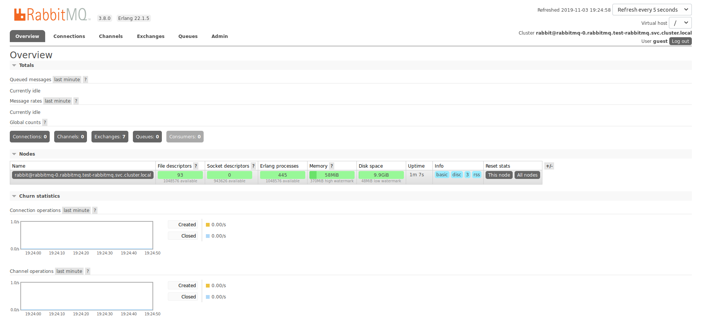

## Definição

Execução dos testes de desempenho usando o protocola AMQP juntamente com o RabbitMQ em um cluster do Kubernetes.

## Ferramentas

*  JMeter
*  AMQP Client 3.6
*  JMeter AMQP Plugin


## Configuração do Cluster

```
kind: Service
apiVersion: v1
metadata:
  namespace: test-rabbitmq
  name: rabbitmq
  labels:
    app: rabbitmq
    type: LoadBalancer
spec:
  type: NodePort
  externalIPs:
    - 192.168.25.2
  ports:
   - name: http
     protocol: TCP
     port: 15672
     targetPort: 15672
   - name: amqp
     protocol: TCP
     port: 5672
     targetPort: 5672
   - name: mqtt
     protocol: TCP
     port: 1883
     targetPort: 1883
  selector:
    app: rabbitmq
---
apiVersion: v1
kind: ConfigMap
metadata:
  name: rabbitmq-config
  namespace: test-rabbitmq
data:
  enabled_plugins: |
      [rabbitmq_management,rabbitmq_peer_discovery_k8s, rabbitmq_mqtt].
  rabbitmq.conf: |
      ## Cluster formation. See https://www.rabbitmq.com/cluster-formation.html to learn more.
      cluster_formation.peer_discovery_backend  = rabbit_peer_discovery_k8s
      cluster_formation.k8s.host = kubernetes.default.svc.cluster.local
      ## Should RabbitMQ node name be computed from the pod's hostname or IP address?
      ## IP addresses are not stable, so using [stable] hostnames is recommended when possible.
      ## Set to "hostname" to use pod hostnames.
      ## When this value is changed, so should the variable used to set the RABBITMQ_NODENAME
      ## environment variable.
      cluster_formation.k8s.address_type = hostname
      ## How often should node cleanup checks run?
      cluster_formation.node_cleanup.interval = 30
      ## Set to false if automatic removal of unknown/absent nodes
      ## is desired. This can be dangerous, see
      ##  * https://www.rabbitmq.com/cluster-formation.html#node-health-checks-and-cleanup
      ##  * https://groups.google.com/forum/#!msg/rabbitmq-users/wuOfzEywHXo/k8z_HWIkBgAJ
      cluster_formation.node_cleanup.only_log_warning = true
      cluster_partition_handling = autoheal
      ## See https://www.rabbitmq.com/ha.html#master-migration-data-locality
      queue_master_locator=min-masters
      ## This is just an example.
      ## This enables remote access for the default user with well known credentials.
      ## Consider deleting the default user and creating a separate user with a set of generated
      ## credentials instead.
      ## Learn more at https://www.rabbitmq.com/access-control.html#loopback-users
      loopback_users.guest = false
      mqtt.listeners.tcp.default = 1883
      mqtt.default_user = rabbit
      mqtt.default_pass = s3kRe7
      mqtt.vhost            = /
      mqtt.exchange         = amq.topic
      # 24 hours by default
      mqtt.subscription_ttl = 86400000
      mqtt.prefetch         = 10
---
apiVersion: apps/v1
# See the Prerequisites section of https://www.rabbitmq.com/cluster-formation.html#peer-discovery-k8s.
kind: StatefulSet
metadata:
  name: rabbitmq
  namespace: test-rabbitmq
spec:
  selector:
    matchLabels:
      app: rabbitmq
  serviceName: rabbitmq
  # Three nodes is the recommended minimum. Some features may require a majority of nodes
  # to be available.
  replicas: 1
  template:
    metadata:
      labels:
        app: rabbitmq
    spec:
      serviceAccountName: rabbitmq
      terminationGracePeriodSeconds: 10
      nodeSelector:
        # Use Linux nodes in a mixed OS kubernetes cluster.
        # Learn more at https://kubernetes.io/docs/reference/kubernetes-api/labels-annotations-taints/#kubernetes-io-os
        kubernetes.io/hostname: bahamut
      containers:
      - name: rabbitmq-k8s
        image: rabbitmq:3.8
        volumeMounts:
          - name: config-volume
            mountPath: /etc/rabbitmq
        # Learn more about what ports various protocols use
        # at https://www.rabbitmq.com/networking.html#ports
        ports:
          - name: http
            protocol: TCP
            containerPort: 15672
          - name: amqp
            protocol: TCP
            containerPort: 5672
        livenessProbe:
          exec:
            # This is just an example. There is no "one true health check" but rather
            # several rabbitmq-diagnostics commands that can be combined to form increasingly comprehensive
            # and intrusive health checks.
            # Learn more at https://www.rabbitmq.com/monitoring.html#health-checks.
            #
            # Stage 2 check:
            command: ["rabbitmq-diagnostics", "status"]
          initialDelaySeconds: 60
          # See https://www.rabbitmq.com/monitoring.html for monitoring frequency recommendations.
          periodSeconds: 60
          timeoutSeconds: 15
        readinessProbe:
          exec:
            # This is just an example. There is no "one true health check" but rather
            # several rabbitmq-diagnostics commands that can be combined to form increasingly comprehensive
            # and intrusive health checks.
            # Learn more at https://www.rabbitmq.com/monitoring.html#health-checks.
            #
            # Stage 2 check:
            command: ["rabbitmq-diagnostics", "status"]
            # To use a stage 4 check:
            # command: ["rabbitmq-diagnostics", "check_port_connectivity"]
          initialDelaySeconds: 20
          periodSeconds: 60
          timeoutSeconds: 10
        imagePullPolicy: Always
        env:
          - name: MY_POD_NAME
            valueFrom:
              fieldRef:
                apiVersion: v1
                fieldPath: metadata.name
          - name: MY_POD_NAMESPACE
            valueFrom:
              fieldRef:
                fieldPath: metadata.namespace
          - name: RABBITMQ_USE_LONGNAME
            value: "true"
          # See a note on cluster_formation.k8s.address_type in the config file section
          - name: K8S_SERVICE_NAME
            value: rabbitmq
          - name: RABBITMQ_NODENAME
            value: rabbit@$(MY_POD_NAME).$(K8S_SERVICE_NAME).$(MY_POD_NAMESPACE).svc.cluster.local
          - name: K8S_HOSTNAME_SUFFIX
            value: .$(K8S_SERVICE_NAME).$(MY_POD_NAMESPACE).svc.cluster.local
          - name: RABBITMQ_ERLANG_COOKIE
            value: "mycookie"
      volumes:
        - name: config-volume
          configMap:
            name: rabbitmq-config
            items:
            - key: rabbitmq.conf
              path: rabbitmq.conf
            - key: enabled_plugins
              path: enabled_plugins
```

## Estado Inicial do Cluster




## Payload


```
4d a9 71 00 b5 69 11 f8 59 50 ec 3a 73 ba 37 d1 
d8 a0 fe 92 3a 9a fa 09 05 d2 da 17 36 41 a4 3d 
74 c8 98 9d ed e3 55 5a a9 97 5d 73 96 25 dd b6 
95 1c d4 e5 01 b8 f8 98 8d 53 82 e2 ba c3 48 d2 
ed 9b c3 4a 3b 2f 0e b8 09 f3 1e fd 6e af 43 f7 
c7 ff d1 3f 70 85 ea 4b 68 c8 38 31 0b 5b 08 00 
ad fb 53 df b8 00 4f 82 0f bd 51 fb 7d 69 15 a3 
11 40 f8 ec c1 5e c7 4b 52 5d 24 93 41 2f 7b 17 
b9 5f 98 f5 d1 bd 1c 8b fe 23 d8 cf 53 ff 74 2f 
c9 14 1c cb e8 82 95 00 e2 5e 7b af 84 1e 25 6c 
7e 2b f2 72 38 68 87 8e d9 2e 89 7e f9 ea 55 49 
55 f2 50 f3 ce bd ad b4 5c e5 03 5a ab dd 54 45 
74 13 80 0f 67 3f 09 3d c5 25 1c 82 e6 98 e8 aa 
bf 94 3e c2 5b c8 81 76 a5 68 04 4e 66 5f 14 53 
09 3e 59 b2 89 b9 3f cb dc 40 36 e0 3d 67 c6 10 
ea 49 8b de a3 ac e9 15 bb 3a 0f 5c 78 90 ad 9a 
e1 1c 5c 08 93 b0 5f 3f 0d a5 bf 08 5b ce 70 50 
fd 61 71 d7 5c 1d 0f 2b bd 4f 7e 6a da e8 72 27 
ea 7e 69 3c 55 66 8a 12 91 6d 8c 69 11 94 60 2e 
96 93 2f 8f 49 dc d2 21 36 e2 5a c3 fb ed f1 a9 
f8 38 e7 b1 1a 2d 3b 4e c8 66 aa ce bd 1e da 60 
ca 9f af 0b 04 15 4e 55 3c 33 9a 0e 76 dc 3b 9c 
77 17 d6 46 1c 29 50 15 d8 3a ed 97 cd ef 0e 25 
d2 f8 89 8a a6 5d 38 98 2a 48 e2 d8 ef 3c 7a e8 
da 13 9c eb 0a 56 0a 6b 55 0b 45 7c 5e 5e c7 c9 
c7 6d aa ea fb bb eb 47 66 75 f2 30 74 f0 7a fa 
fe 0e a7 20 da a8 9d 8a a4 10 e7 47 0b 46 ac 5f 
2f 84 da 3e 5a 54 00 31 6b e4 16 3f d2 f1 a3 29 
00 52 75 fc d4 9f ce ae ea 9e 59 1f 70 e7 21 46 
c4 a8 9a 6f 3d d6 20 af 6a b6 44 3c 0d a4 46 88 
32 42 b7 fa ad 0d 75 33 15 03 40 45 dc 7e 3b 89 
70 31 fd 99 f5 d6 72 4e 8a 5d 71 bb 73 65 e7 55 
7c b9 da a8 51 4f 62 70 6f eb f5 62 67 f2 2b c4 
5f 8c 7d d0 65 b4 cd fc bd e2 e7 83 c4 ec c6 e3 
67 1c 04 17 b4 ac 5f 51 1e dd 09 78 27 82 8e 30 
63 8f 0c 19 1e 86 86 b6 2f d1 47 7b 1b 4e 6f c4 
99 e5 33 56 cd 3b af a1 87 f6 80 66 0a d3 2b 76 
d8 5f 0c 10 c1 b4 bf 06 48 2a 3a 3b c3 96 3e 80 
d2 8e 88 58 8e 5c 68 78 79 ef 30 73 d9 49 46 24 
00 55 b7 0d 5a 44 12 1c 4f 8d 98 60 a9 f9 4b 39 
28 e9 f8 7c 19 a4 b2 70 01 49 25 5a 04 f5 91 52 
05 a4 15 8e bf ac ca 15 79 cc 3b 4f 60 da c9 a1 
f4 3c ba 4d 6d 27 e4 de 06 0c 50 41 ce 3e 45 1f 
f1 39 c3 24 dc a6 76 cf c3 bd 25 c3 2a db f8 89 
f4 2d 8b 4a 92 5c 25 8d b1 4a f0 46 67 05 6b c6 
3d c0 b6 17 6f 41 b7 fe 64 70 26 2d 05 9d bf 7c 
72 8a a8 49 37 fa 37 df 0f b8 8f cd 61 d3 6d db 
1a c0 4d d2 f9 ef 5f f2 a2 17 28 48 df 25 d5 77 
a0 e7 ff 71 68 bb f4 25 68 4a aa a0 26 72 31 78 
0d bb e2 f6 07 44 e4 45 1c 63 46 f6 91 e3 3d 8b 
d7 45 e5 62 6a 2e 5a c0 a5 72 41 6b d4 f5 5f e3 
f9 4e 2a 07 5c 71 ee 2c ed 8a 23 f6 16 ac 70 73 
74 5b e4 72 5b 87 ab e8 59 46 99 a7 42 81 58 56 
80 ad 

```


## Testes

### Teste 0


### Teste 1


### Teste 2
