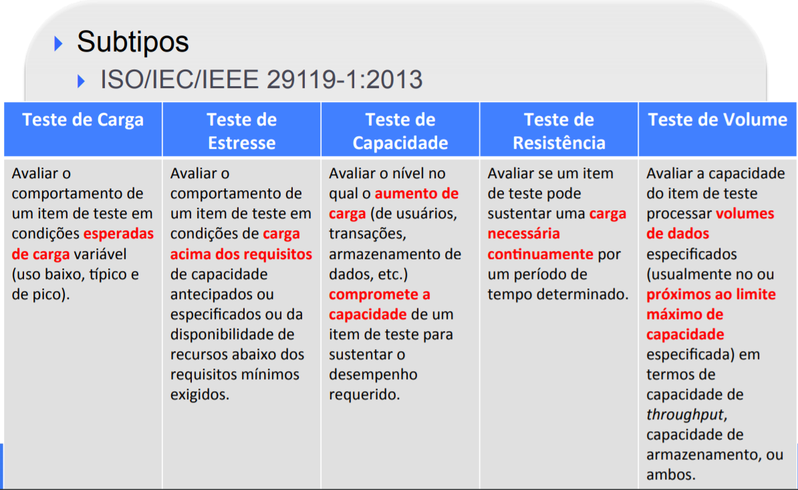

# Testes de Desempenho

## Medidas de Desempenho

## Subtipos de Testes de Desempenho

## Escolhas Para os Testes do Cluster

### Subtipos

1.  Teste de Carga
2.  Teste de Estresse
3.  Teste de Capacidade

### Variáveis Independentes

1.  Carga máxima.
2.  Usuários.
3.  Rampa.
4.  Tempo de Resposta Tolerável.
5.  Número de Agentes. 

### Variáveis Dependentes

1. Usuários Ativos.
2. Tempo Médio de Resposta.
3. Porcentagem de Erros.
4. Throughput.

## Operacionalização

### JMeter CLI + GUI

O JMeter oferece a possibilidade de utilizar a ferramenta como CLI ou GUI para a realização dos testes de desempenho, podendo depois exportar os dados em diversos formatos (XML, CSV).

### JMeter Operator + InfluxDB + Grafana

O grupo [Kubernauts](https://github.com/kubernauts) disponiblizou abertamente um operador para realizar testes de Carga no Kubernetes utilizando o JMeter. Essa configuração utiliza o InfluxDB para criar uma série temporal dos dados que são gerados por Pods do JMeter nos nós do Kubernetes, a série temporal dos dados então é lida por um Pod do Grafana para apresentar os dados em uma interface mais amigável.

