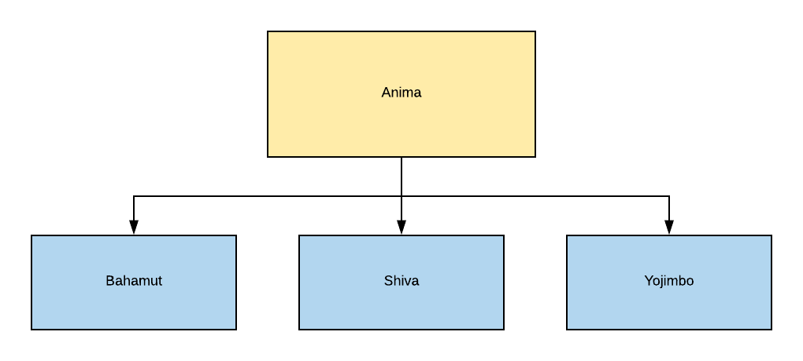
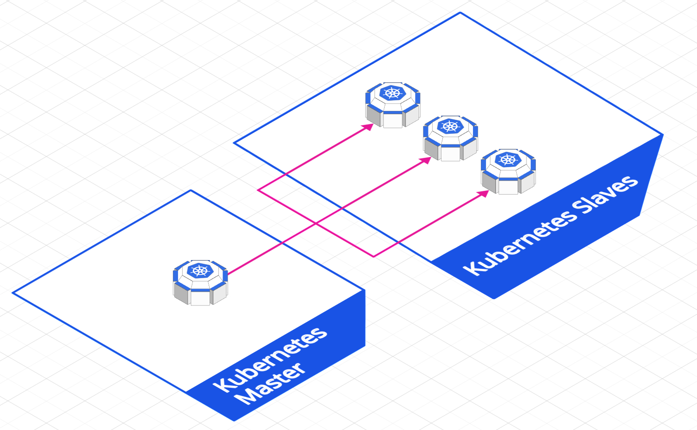

# Topologia

## Configurações

### Anima - Master

* **CPU:** Intel(R) Core(TM) i5-7400 CPU @ 3.00GHz
* **RAM:** 16 GB 2400 Mhz
* **HD:** 500 Gb Samsung 860 EVO SSD
* **Sistema:** Ubuntu 19.04 x64

### Bahamut

* **Modelo:** Raspberry 3 B+ 1.2 
* **CPU:** 1.4 Ghz Cortex A-53 (ARMv8)
* **RAM:** 1 Gb 900 Mhz
* **HD:** 16 Gb Class 10
* **Sistema:** Raspbian 9.9 Strech

### Shiva

* **Modelo:** Raspberry 1 B+ 1.0
* **CPU:** 0.7 Ghz 1176JZF-S
* **RAM:** 512 Mb 
* **HD:** 16 Gb Class 10
* **Sistema:** Raspbian 9.9 Strech

### Yojimbo

* **Modelo:** Raspberry 1 A+ 1.1
* **CPU:** 0.7 Ghz 1176JZF-S
* **RAM:** 512 Mb 
* **HD:** 16 Gb Class 10
* **Sistema:** Raspbian 9.9 Strech

